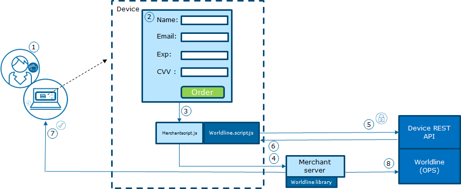

# Worldline Online Payments Acceptance - Spring Boot example
Using this Spring application, you can gain understanding of how the Worldline Online Payments Acceptance 
Device Payment API can be used in an easy integration from a device, in this case using JavaScript and with
a server using Spring Boot.

Are you looking for documentation of the APIs used in this example? Then check out 
* The [Javascript Payment API](docs/worldine-online-payments-acceptance-javascript-api.md) used by the browser.
* The [Java Payment API](https://github.com/WorldlineNordics/payment-api) used on the server side. 

### What you'll need

* About 15 minutes
* Java [JDK 8](http://www.oracle.com/technetwork/java/javase/downloads/index.html) or later
* A copy of this repository, or rather an installation of [Git](https://www.atlassian.com/git/tutorials/install-git)

## How to use this example application
 
**Step 1**. Clone the application with Git, or [download a copy](https://github.com/WorldlineNordics/payment-api-spring-demo/archive/master.zip).
 ```bash
git clone https://github.com/WorldlineNordics/payment-api-spring-demo
cd payment-api-spring-demo
```
 
**Step 2**. Start the demo application by
 ```bash
 ./gradlew bootRun
 ```

**Step 3**. Open [http://localhost:8080/] 

Enter a name, a test card number, like 4112344112344113, a random CVV and execute a transaction. 

The demo page will then step through:
1. Call to the local demo application for "registering" a user.
2. Payment processing with Worldline
3. Presentation of result and transaction ID of the completed transaction.

## Details of the demo



1. The customer has completed shopping and is checking out from the merchant store.
2. On checkout, the customer is presented with a payment page which is a HTML page 
   hosted by the merchant.
3. The customer provides the name, billing info and other user details along 
   with the card details like the card number, card holder name, cv code and expiry date. 
   On submission, the customer details are passed to the demo.js,
   i.e. customer details will be sent directly to the merchant server.
4. The merchant server connects to the Java PaymentAPI to sign and encrypts amount, merchant 
   integration details and parameters like email and other sensitive data.  
5. The Worldline Javascript API passes on the encrypted data together with card holder details
   to the Worldline Device Payment API server.
6. The Device Payment API processes the transaction, optionally tokenizes, proceeds with fraud
   screening and routes an authorization to the acquiring bank.
   The signature of the response is validated and the result is decrypted using the unpack
   method.  
7. Lastly, the merchant can display the order confirmation message along with 
   the status of the transaction.
8. Optionally, the merchant can call upon Worldline for follow-up requests for Cancellations, Refunds,
   Settlements or Recurring charges.
9. The demo server will display more results of the payment transaction E.g.
   ````
     ------------------------------ Response ------------------------------
     Status                   : OK                                                                             
     Client Answer Code       : 0                                                           
     Masked Card              : 411234XXXXXX4113                                            
     Payment Method Name      : Visa                                                        
     Auth Code                : 123456                                                      
     TransactionId            : 5022892566                                                  
     TransactionDesc          : Transaction Accepted                                        
     Token                    : 9000037339084113                                            
     Token Masked Card        : 411234XXXXXX4113                                            
     Token expiry date        : 03-2018                                                     
     Currency                 : BRL                                                         
     Order Amount             : 100.00                                                      
     Fulfilment Amount        : 100.00                                                      
     Captured Amount          : 100.00                                                                  
     Refunded Amount          : 0.00                                                        
     Transaction State        : Processed                                                   
````

*Overview or response fields:*

* The **TransactionID** is the reference from Worldline on this transaction, and the **Transaction State** is
the result of the transaction. 
* If tokenization was requested, the Token is the reference to be used in 
subsequent recurring transactions. The Token Masked Card, Payment Method name and Token expiry date
can be used to present options for chosing this payment method in future interactions.
* The **Status** **OK** indicates that the request was successful. If the
**Status** instead was **PENDING**, **RETRY** or **ERROR*, the **Client Answer Code** indicates
the reason.
* The last four amounts tells about the sum of transactions that has been processed on this order.
** The **Order Amount** shows what is expected to be paid on this order.
** The **Fulfilment Amount** shows what the acquirer has reported as successfully as the reserved (authorized) amount. 
** If the transaction was captured, in this API with auto-capture, the **Captured Amount** indicates how much that has been requested to settle the
authorization.
** The **Refunded Amount** indicates the amount that the merchant has requested to be credited back to the consumer on this order.
 


See the [PaymentAPI documentation on Responses][2] for further information on fields.

### Role of JavaScripts in Demo Application
1. The javascripts i.e. the demo.js and the worldline-script.js should be referenced in index.html file.
2. Once the user details are submitted using payment form, the example API /api/users/registrations is 
   called by the demo.js script to encrypt this form data.
3. The encrypted request containing user details and the card details are passed using the 
   worldline-script.js to Worldline for processing the transaction.
4. The encrypted transaction response received from Worldline is unpacked using 
   the example API /api/users/unpackResponse. 


## LICENSE
See [LICENSE] file

[LICENSE]: license

[http://localhost:8080/]: http://localhost:8080/

[2]: https://github.com/WorldlineNordics/payment-api/blob/master/docs/device-payment-api.md#response-details